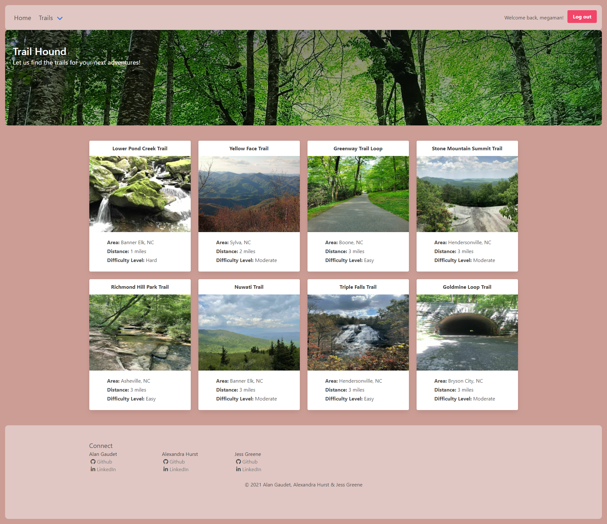
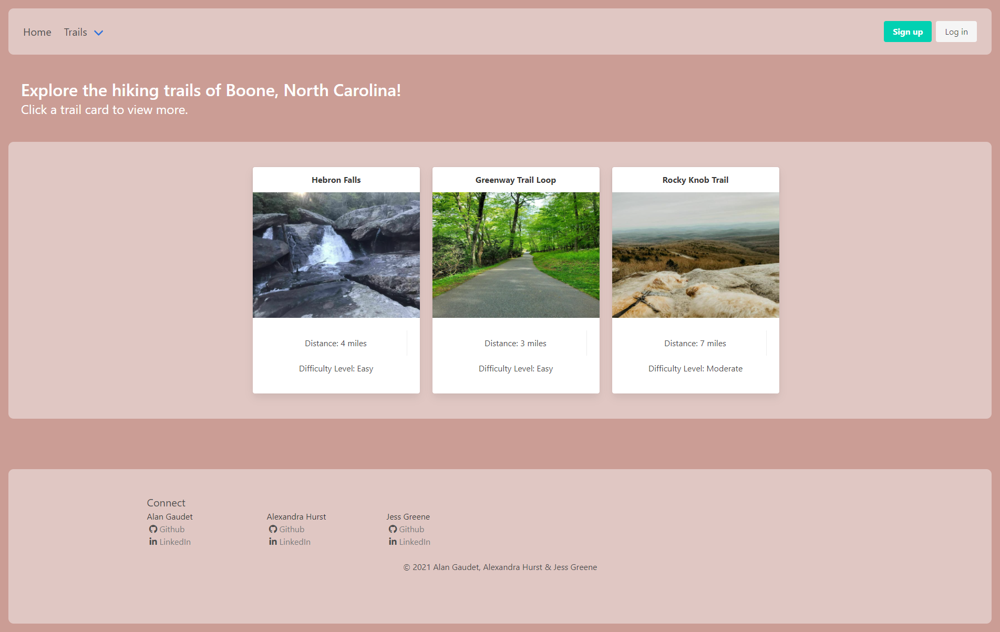

# trail-hiking-app
An app designed to allow users to find new and exciting places to plan their next adventure.

## Table of contents
* [User Story](#user-story)
* [Deployed Website](#deployedwebsite)
* [Description & Features](#description)
* [Screenshots](#screenshots)
* [Tech/Framework](#tech/framework)
* [Credits](#credits)
* [License](#license)

## User Story

    AS an avid hiker,
    I WANT to be able to search for trails in different cities,
    SO THAT I can plan my vacations and adventures based on my skill level and interests.

## Deployed Website

https://western-nc-trail-app.herokuapp.com/

## Description

This application allows the user to search and add trails that they have visited in North Carolina. They are presented with a dropdown search bar of 7 cities in NC from which they can choose. They are then brought to a page that displays the trails from that city that are seeded in our database. They have an option to sign up/log in at the top of the page. User can search any location given in the drop down, select trails from that search and view all details of said trail, including geo-coordinates. They can also add images to trail's pages.

## Features

* If the user selects a city from the drop down menu, they are taken to a page with all trails in database for that location.

* Once clicked on a certain trail, they are then taken to a page with that trail's details and all features displayed along with a link to the geo-coordinates for directions. They have the ability to add images to specific trails on that trail's individual page. 

* A user has the option to sign up and log in. 

## Screenshots

## Tech/Framework

- VS Code
- JavaScript
- Bulma
- MYSQL
- Cloudinary
- Handlebars

## Credits

Alexandra Hurst 

Alan Gaudet

Jess Greene 

## License

